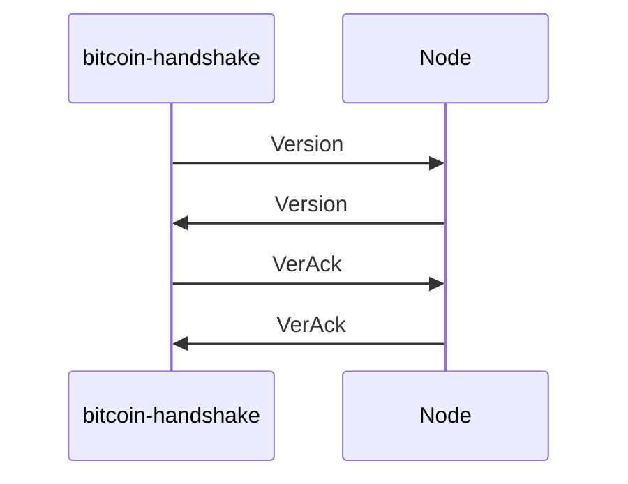

# bitcoin-handshake

Proof-of-concept tool performing bitcoin protocol handshake with a set of nodes, according to the [protocol documentation](https://developer.bitcoin.org/reference/p2p_networking.html#p2p-network).

It consists of two parts:

- Library, defining Bitcoin protocol messages' data structures.
- Binary, built with tokio-rs, that handles all the IO with remote node(s).

## Usage

You need to provide the address of a Bitcoin's DNS seed.

```
Usage: bitcoin-handshake [OPTIONS] <DNS_SEED>

Arguments:
  <DNS_SEED>  Bitcoin DNS seed to connect to

Options:
  -p, --port <PORT>        TCP port to connect to [default: 8333]
  -t, --timeout <TIMEOUT>  Handshake timeout, in seconds [default: 10]
  -h, --help               Print help information
  -V, --version            Print version information
```

For example:

```
cargo run -- seed.bitcoin.sipa.be
```

This will give you output similiar to following one:

```log
2022-11-17T22:46:55.331282Z  INFO bitcoin_handshake: Resolving DNS seed `seed.bitcoin.sipa.be`
2022-11-17T22:46:55.334820Z  INFO bitcoin_handshake: Resolved 25 addreses. Starting handshakes...
2022-11-17T22:46:55.410754Z ERROR handshake{target=13.48.127.4:8333}: bitcoin_handshake: handshake attempt failed with: IO Error during (de)serialization: failed to fill whole buffer
2022-11-17T22:46:55.417025Z ERROR handshake{target=176.9.84.209:8333}: bitcoin_handshake: handshake attempt failed with: IO Error during (de)serialization: failed to fill whole buffer
2022-11-17T22:46:55.442688Z ERROR handshake{target=65.108.200.37:8333}: bitcoin_handshake: handshake attempt failed with: IO Error during (de)serialization: failed to fill whole buffer
2022-11-17T22:46:55.442910Z  WARN handshake{target=87.236.195.198:8333}: bitcoin_handshake: expected message command `verack` but got `sendheaders` instead
2022-11-17T22:46:55.447682Z  WARN handshake{target=104.244.73.6:8333}: bitcoin_handshake: expected message command `verack` but got `sendheaders` instead
2022-11-17T22:46:55.455978Z  WARN handshake{target=5.9.105.68:8333}: bitcoin_handshake: expected message command `verack` but got `sendheaders` instead
2022-11-17T22:46:55.465712Z  WARN handshake{target=3.8.133.46:8333}: bitcoin_handshake: expected message command `verack` but got `sendheaders` instead
2022-11-17T22:46:55.465785Z  WARN handshake{target=188.166.102.98:8333}: bitcoin_handshake: expected message command `verack` but got `sendheaders` instead
2022-11-17T22:46:55.469527Z ERROR handshake{target=31.18.168.192:8333}: bitcoin_handshake: handshake attempt failed with: IO Error during (de)serialization: failed to fill whole buffer
2022-11-17T22:46:55.479653Z ERROR handshake{target=79.115.212.244:8333}: bitcoin_handshake: handshake attempt failed with: IO Error during (de)serialization: failed to fill whole buffer
2022-11-17T22:46:55.485573Z  WARN handshake{target=84.255.244.61:8333}: bitcoin_handshake: expected message command `verack` but got `sendheaders` instead
2022-11-17T22:46:55.487334Z ERROR handshake{target=80.94.107.94:8333}: bitcoin_handshake: handshake attempt failed with: IO Error during (de)serialization: failed to fill whole buffer
2022-11-17T22:46:55.497705Z  WARN handshake{target=143.110.175.248:8333}: bitcoin_handshake: expected message command `verack` but got `sendheaders` instead
2022-11-17T22:46:55.581902Z  WARN handshake{target=2.59.236.56:8333}: bitcoin_handshake: expected message command `verack` but got `sendheaders` instead
2022-11-17T22:46:55.739703Z  WARN handshake{target=3.138.122.100:8333}: bitcoin_handshake: expected message command `verack` but got `sendheaders` instead
2022-11-17T22:46:55.784641Z  WARN handshake{target=173.48.112.106:8333}: bitcoin_handshake: expected message command `verack` but got `sendheaders` instead
2022-11-17T22:46:55.786252Z  WARN handshake{target=74.76.43.77:8333}: bitcoin_handshake: expected message command `verack` but got `sendheaders` instead
2022-11-17T22:46:55.876216Z  WARN handshake{target=154.38.167.152:8333}: bitcoin_handshake: expected message command `verack` but got `sendheaders` instead
2022-11-17T22:46:55.882179Z  WARN handshake{target=3.101.67.35:8333}: bitcoin_handshake: expected message command `verack` but got `sendheaders` instead
2022-11-17T22:46:55.882410Z  WARN handshake{target=13.66.248.91:8333}: bitcoin_handshake: expected message command `verack` but got `sendheaders` instead
2022-11-17T22:46:55.891033Z  WARN handshake{target=13.57.250.92:8333}: bitcoin_handshake: expected message command `verack` but got `sendheaders` instead
2022-11-17T22:46:55.891536Z ERROR handshake{target=13.112.248.184:8333}: bitcoin_handshake: handshake attempt failed with: IO Error during (de)serialization: failed to fill whole buffer
2022-11-17T22:46:56.119996Z  WARN handshake{target=13.113.139.174:8333}: bitcoin_handshake: expected message command `verack` but got `sendheaders` instead
2022-11-17T22:46:56.120468Z  INFO bitcoin_handshake: Finished! Handshake results: 2 OK | 16 PARTIALLY OK | 7 FAILED
```

The last line of the output should contain the results of handshake attempts.

The log level output can be controlled using `RUST_LOG` environment variable (defaults to `info`).

## How it works

The tool tries to perform an exchange of `version` and `verack` messages.



After this exchange, other messages can flow between nodes.

However, more often than not, bitcoin nodes tend to omit returning the `verack` message,
and instead start sending other messages like `inv` or `sendheaders`. This is either
an implementation [flaw/optimization](https://developer.bitcoin.org/reference/intro.html#not-a-specification), or a misunderstanding of the protocol doc on my side.

Due to this, we treat a handshake that did not return the `verack` message, but still sends
other messages, as `PARTIALLY OK`.

## Implementation details

No bitcoin-related crates were used, for a reason.

This create can potentially, but unlikely, be evolved into full-fledged bitcoin protocol implementation.
