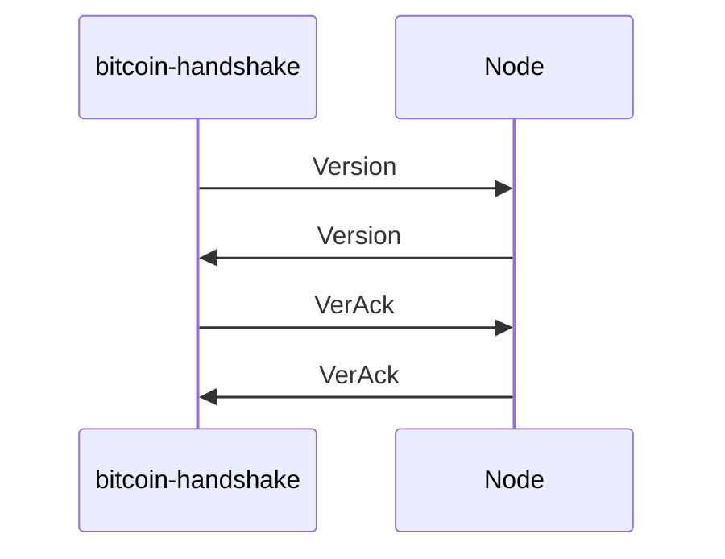

# bitcoin-handshake

Proof-of-concept tool performing bitcoin protocol handshake with a set of nodes, according to the [protocol documentation](https://developer.bitcoin.org/reference/p2p_networking.html#p2p-network).

It consists of two parts:

- Library, defining Bitcoin protocol messages' data structures.
- Binary, built with tokio-rs, that handles all the IO with remote node(s).

## Usage

You need to provide the address of a Bitcoin's DNS seed.

```
Usage: bitcoin-handshake [OPTIONS] <DNS_SEED>

Arguments:
  <DNS_SEED>  Bitcoin DNS seed to connect to

Options:
  -p, --port <PORT>        TCP port to connect to [default: 8333]
  -t, --timeout <TIMEOUT>  Handshake timeout, in seconds [default: 10]
  -h, --help               Print help information
  -V, --version            Print version information
```

For example:
```
cargo run -- seed.bitcoin.sipa.be
```

This will give you output similiar to following one:

```
[2022-11-16T20:37:33Z INFO  bitcoin_handshake] Resolving DNS seed `seed.bitcoin.sipa.be`
[2022-11-16T20:37:33Z INFO  bitcoin_handshake] Resolved 25 addreses. Starting handshakes...
[2022-11-16T20:37:33Z ERROR bitcoin_handshake] `2.200.165.248:8333`: Handshake attempt failed with: IO Error during (de)serialization: failed to fill whole buffer
[2022-11-16T20:37:33Z WARN  bitcoin_handshake] `104.248.139.211:8333`: expected message command `verack` but got `sendheaders` instead
[2022-11-16T20:37:33Z WARN  bitcoin_handshake] `80.241.211.241:8333`: expected message command `verack` but got `sendheaders` instead
[2022-11-16T20:37:33Z ERROR bitcoin_handshake] `159.224.189.250:8333`: Handshake attempt failed with: IO Error during (de)serialization: failed to fill whole buffer
[2022-11-16T20:37:34Z WARN  bitcoin_handshake] `5.79.84.204:8333`: expected message command `verack` but got `sendheaders` instead
[2022-11-16T20:37:34Z WARN  bitcoin_handshake] `3.9.120.33:8333`: expected message command `verack` but got `sendheaders` instead
[2022-11-16T20:37:34Z WARN  bitcoin_handshake] `81.224.44.164:8333`: expected message command `verack` but got `sendheaders` instead
[2022-11-16T20:37:34Z WARN  bitcoin_handshake] `82.64.49.27:8333`: expected message command `verack` but got `sendheaders` instead
[2022-11-16T20:37:34Z WARN  bitcoin_handshake] `34.247.49.32:8333`: expected message command `verack` but got `sendheaders` instead
[2022-11-16T20:37:34Z WARN  bitcoin_handshake] `3.249.252.78:8333`: expected message command `verack` but got `sendheaders` instead
[2022-11-16T20:37:34Z WARN  bitcoin_handshake] `213.250.21.112:8333`: expected message command `verack` but got `sendheaders` instead
[2022-11-16T20:37:34Z WARN  bitcoin_handshake] `85.208.71.39:8333`: expected message command `verack` but got `sendheaders` instead
[2022-11-16T20:37:34Z WARN  bitcoin_handshake] `46.208.252.189:8333`: expected message command `verack` but got `sendheaders` instead
[2022-11-16T20:37:34Z WARN  bitcoin_handshake] `5.15.28.107:8333`: expected message command `verack` but got `sendheaders` instead
[2022-11-16T20:37:34Z ERROR bitcoin_handshake] `173.255.204.124:8333`: Handshake attempt failed with: IO Error during (de)serialization: failed to fill whole buffer
[2022-11-16T20:37:34Z WARN  bitcoin_handshake] `73.153.176.182:8333`: expected message command `verack` but got `sendheaders` instead
[2022-11-16T20:37:34Z ERROR bitcoin_handshake] `3.35.1.75:8333`: Handshake attempt failed with: IO Error during (de)serialization: failed to fill whole buffer
[2022-11-16T20:37:34Z WARN  bitcoin_handshake] `13.244.60.210:8333`: expected message command `verack` but got `sendheaders` instead
[2022-11-16T20:37:34Z WARN  bitcoin_handshake] `185.148.146.246:8333`: expected message command `verack` but got `sendheaders` instead
[2022-11-16T20:37:34Z WARN  bitcoin_handshake] `184.64.190.218:8333`: expected message command `verack` but got `sendheaders` instead
[2022-11-16T20:37:34Z WARN  bitcoin_handshake] `158.140.141.69:8333`: expected message command `verack` but got `sendheaders` instead
[2022-11-16T20:37:34Z WARN  bitcoin_handshake] `159.89.42.205:8333`: expected message command `verack` but got `sendheaders` instead
[2022-11-16T20:37:34Z INFO  bitcoin_handshake] Finished! Handshake results: 3 OK | 18 PARTIALLY OK | 4 FAILED
```

The last line of the output should contain the results of handshake attempts.

The log level output can be controlled using `RUST_LOG` environment variable (defaults to `info`).

## How it works

The tool tries to perform an exchange of `version` and `verack` messages.



After this exchange, other messages can flow between nodes.

However, more often than not, bitcoin nodes tend to omit returning the `verack` message,
and instead start sending other messages like `inv` or `sendheaders`. This is either
an implementation [flaw/optimization](https://developer.bitcoin.org/reference/intro.html#not-a-specification), or a misunderstanding of the protocol doc on my side.

Due to this, we treat a handshake that did not return the `verack` message, but still sends
other messages, as `PARTIALLY OK`.

## Implementation details

No bitcoin-related crates were used, for a reason.

This create can potentially, but unlikely, be evolved into full-fledged bitcoin protocol implementation.
